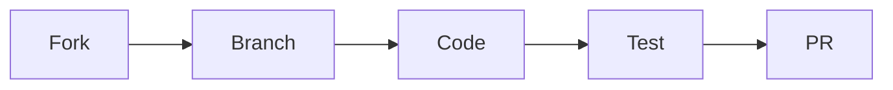

# Destiny Matrix Chart App 🌌

[](https://python.org)
[](https://fastapi.tiangolo.com)
[](https://docker.com)
[](LICENSE)


## ✨ Key Features

- **Precise Calculations**: Life Path, Expression & Soul Urge numbers
- **Full DevOps Pipeline**: CI/CD with GitHub Actions
- **Real-time Monitoring**: Prometheus + Grafana dashboard
- **Scalable Infrastructure**: Kubernetes-ready
- **Secure**: JWT Authentication (Coming Soon)

## 🚀 30-Second Deployment

```bash
# Clone with DevOps configs
git clone --branch devops https://github.com/saeedmfat/dockerized-destiny-matrix-chart-app.git
cd dockerized-destiny-matrix-chart-app

# Deploy with Observability
docker-compose -f docker-compose.prod.yml up -d
```

## 🌐 API Endpoints

| Endpoint | Method | Sample Request |
|----------|--------|----------------|
| `/api/calculate` | POST | `{"birth_day":15, "birth_month":3, "birth_year":1992}` |
| `/health` | GET | - |
| `/metrics` | GET | Prometheus Format |

```json
// Sample Response
{
  "life_path_number": 3,
  "interpretation": "Creative, expressive, social",
  "calculation_steps": "Day(15)→6 + Month(3)→3 + Year(1992)→21 = 30→3"
}
```

## 🛠️ Tech Stack Deep Dive

### Core Components
<div align="center">

| Layer | Technology | Version |
|-------|------------|---------|
| **API Framework** | FastAPI | 0.109+ |
| **Database** | PostgreSQL | 15 |
| **Monitoring** | Prometheus + Grafana | Latest |
| **Containerization** | Docker + Compose | 3.8+ |
| **Orchestration** | Kubernetes (Optional) | 1.28+ |

</div>

## 📊 Live Monitoring (Screenshots)


Access locally:
- Prometheus: `http://localhost:9090`
- Grafana: `http://localhost:3000` (admin/admin)

## 🧑‍💻 Developer Guide

### Project Structure
```
dockerized-destiny-matrix-chart-app/
├── backend/               # FastAPI app
│   ├── app/              # Core logic
│   └── tests/            # Pytest cases
├── monitoring/           # Prometheus configs
├── k8s/                  # Kubernetes manifests
├── docker-compose.yml    # Dev config
├── docker-compose.prod.yml # Production
└── README.md
```

### Contribution Flow


## 📜 License
MIT © [Saeed Marefat](https://github.com/saeedmfat)

## 🌟 Special Thanks
[](https://buymeacoffee.com/saeedmfat)
